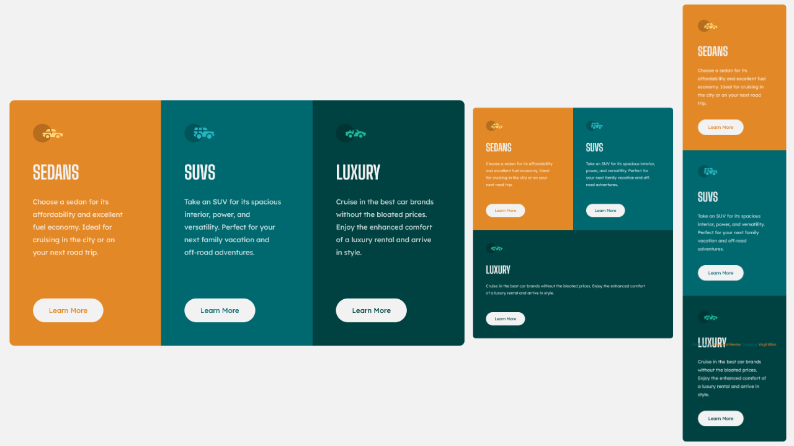

# Frontend Mentor - 3-column preview card component solution

This is a solution to the [3-column preview card component challenge on Frontend Mentor](https://www.frontendmentor.io/challenges/3column-preview-card-component-pH92eAR2-). Frontend Mentor challenges help you improve your coding skills by building realistic projects. 

## Table of contents

- [Overview](#overview)
  - [The challenge](#the-challenge)
  - [Screenshot](#screenshot)
  - [Links](#links)
- [My process](#my-process)
  - [Built with](#built-with)
  - [What I learned](#what-i-learned)
- [Author](#author)

## Overview

### The challenge

Users should be able to:

- View the optimal layout depending on their device's screen size
- See hover states for interactive elements

### Screenshot



### Links

- Solution URL: [Add solution URL here](https://your-solution-url.com)
- Live Site URL: [vejtheguy.github.io/3-column-preview-card-component-main](https://vejtheguy.github.io/3-column-preview-card-component-main/)

## My process

### Built with

- Semantic HTML5 markup
- CSS custom properties
- Flexbox

### What I learned

This was my first project incorporating 'clamp' to help keep the entire page fully responsive without using any '@media queries'.  I have also started to add hidden 'screen reader only' text to help explain elements on the page.

```html
<h1 class="sr-only">Three column preview card</h1>
<button>Learn More<span class="sr-only">about sedans</span></button>
```

```css
.component-text {
    margin-bottom: clamp(25px, 5vw, 70px);
}
```

## Author

- CodePen - [@vejtheguy](https://codepen.io/vejtheguy)
- Frontend Mentor - [@vejtheguy](https://www.frontendmentor.io/profile/vejtheguy)
- Twitter - [@aworthlessgamer](https://twitter.com/aworthlessgamer)

